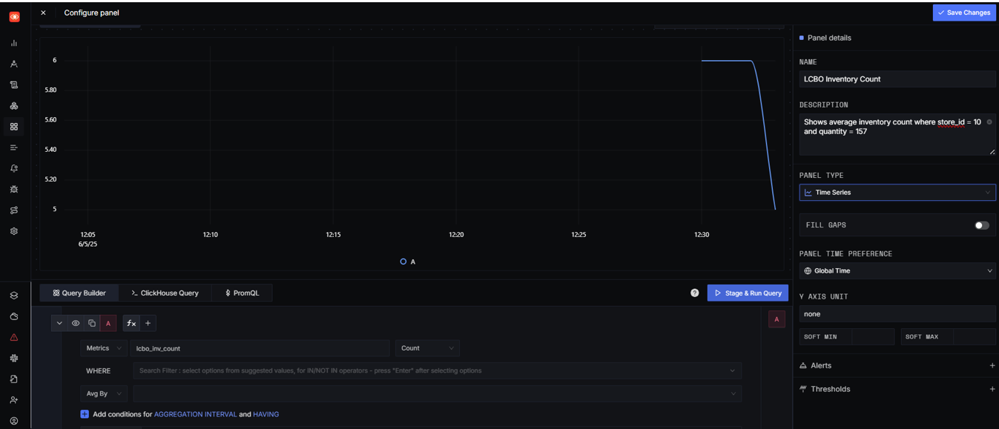
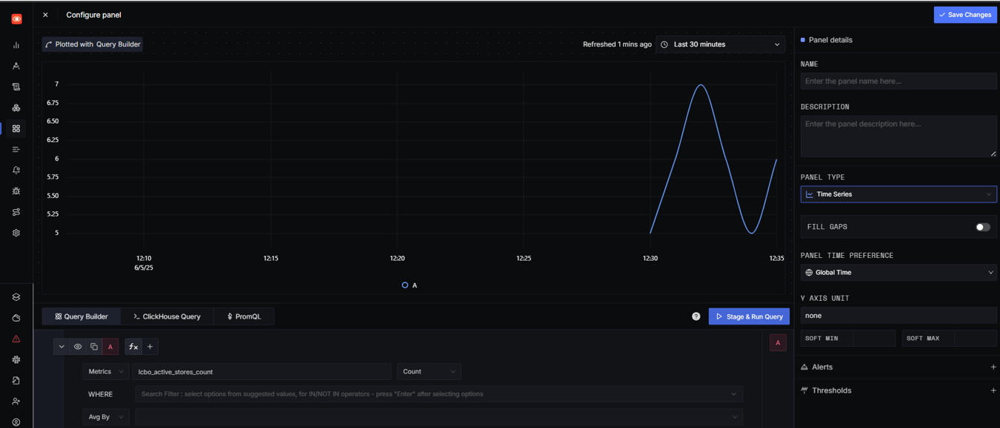
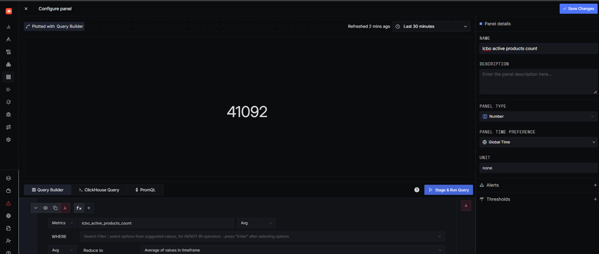
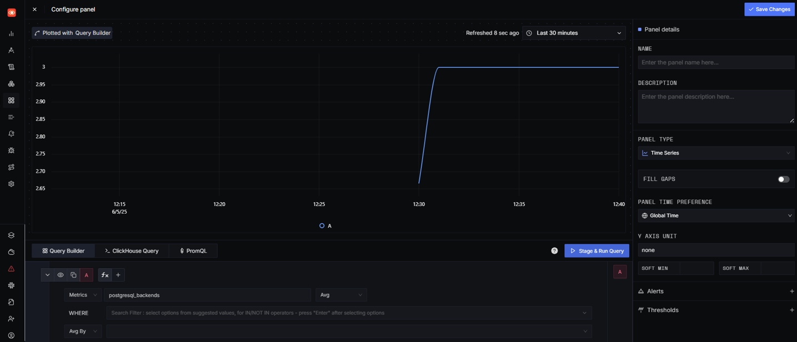

# LCBO Metrics Monitoring with SigNoz + OpenTelemetry

This project demonstrates how to monitor business-specific and PostgreSQL database metrics from the LCBO dataset using **SigNoz**, **OpenTelemetry Collector**, and **Grafana** dashboards.

---

## Technologies Used

- **PostgreSQL** (Database)
- **pgAdmin** (Query verification)
- **SigNoz** (Visualization and monitoring)
- **OpenTelemetry Collector** (Metrics scraping and forwarding)
- **Docker Compose** (Service orchestration)

---

## Screenshots Overview

| Panel | Screenshot |
|-------|------------|
| Docker containers running |  |
| LCBO Inventory Count |  |
| Active Stores Count |  |
| Active Products Count |  |
| PostgreSQL Backends |  |
| Dashboard View |  |
| pgAdmin Verification |  |

---

## Implemented Metrics

### SQLQuery Receiver
| Metric | Description |
|--------|-------------|
| `lcbo_inv_count` | Count of inventory items where `store_id = 10` and `quantity = 157` |
| `lcbo_active_products_count` | Total active products (`is_discontinued = false`) |
| `lcbo_active_stores_count` | Count of distinct active store IDs from inventory |

### PostgreSQL Receiver
| Metric | Description |
|--------|-------------|
| `postgresql.backends` | Number of active backend connections |
| `postgresql.commits` | Total commits executed |
| `postgresql.rollbacks` | Rollback operations |
| `postgresql.database.count` | Total number of databases |
| `postgresql.database.locks` | Current DB-level locks |
| `postgresql.blocks_read` | Disk blocks read from PostgreSQL |

---

## 📋 Configuration Summary

### SQLQuery Block

```yaml
  sqlquery:
    driver: postgres
    datasource: "host=db port=5432 user=devtedsuser password=devtedspass sslmode=disable database=lcbo"
    queries:
      - sql: "select count(*) as count FROM inventories WHERE store_id = 10 AND quantity = 157"
        metrics:
          - metric_name: "lcbo_inv_count"
            value_column: "count"
      - sql: "SELECT COUNT(*) as total_products FROM products WHERE is_discontinued = false"
        metrics:
          - metric_name: "lcbo_active_products_count"
            value_column: "total_products"
      - sql: "SELECT COUNT(DISTINCT store_id) as store_count FROM inventories"
        metrics:
          - metric_name: "lcbo_active_stores_count"
            value_column: "store_count"
```

### PostgreSQL Block

```yaml
  postgresql:
    endpoint: db:5432
    transport: tcp
    username: devtedsuser
    password: devtedspass
    collection_interval: 10s
    tls:
      insecure: true
    databases:
      - lcbo
    metrics:
      postgresql.blocks_read:
        enabled: true
      postgresql.commits:
        enabled: true
      postgresql.rollbacks:
        enabled: true
      postgresql.database.count:
        enabled: true
      postgresql.database.locks:
        enabled: true
```

---

## pgAdmin Verification Queries

```sql
SELECT COUNT(*) FROM inventories WHERE store_id = 10 AND quantity = 157;
SELECT COUNT(*) FROM products WHERE is_discontinued = false;
SELECT COUNT(DISTINCT store_id) FROM inventories;


```

## How to Run

```bash
# Stop all existing containers (if any)
ansible-playbook down.yaml

# Start the setup
ansible-playbook up.yaml

# Verify containers
docker ps
```

Then access:
- SigNoz UI: [http://localhost:3301](http://localhost:3301)
- pgAdmin: [http://localhost:5050](http://localhost:5050)

---

## Author

Twinkle Mishra – 8894858- INFO8985 In-Class Task 2 – Database Metrics with OpenTelemetry + SigNoz

